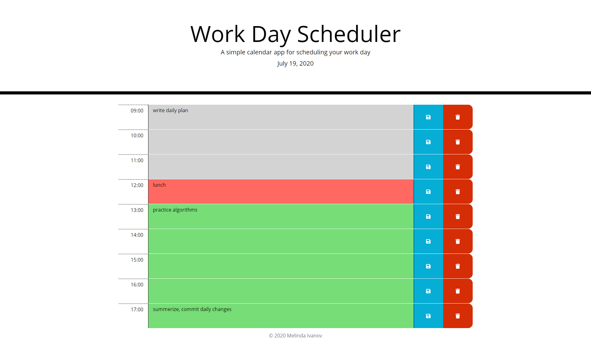

# Work-Day-Scheduler
This calendar application allows the user to save events for each business hour of the day. This app will run in the browser and feature dynamically updated HTML and CSS powered by jQuery. The user can use this daily planner to create a schedule for the current day what is displayed at the top of the calendar. When scrolling down the user is presented with timeblocks for standard business hours and each timeblock is color coded to indicate whether it is in the past (grey), present (red), or future (green). When clicking into a timeblock the user can enter an event. By click the save button for that timeblock the event is saved in the local storage or by clicking the delete button the event is deleted from it.

**Author:** Melinda Ivanov

demo image:

## Links
- https://github.com/jnsmelinda/Work-Day-Scheduler
- https://jnsmelinda.github.io/Work-Day-Scheduler

## Technologies
- [JavaScript](https://www.javascript.com)
- [JQuery](https://jquery.com/)
- [HTML5](https://en.wikipedia.org/wiki/HTML5)
- [CSS3](https://en.wikipedia.org/wiki/Cascading_Style_Sheets)
- [Git](https://git-scm.com/), [GitHub](https://github.com)
- [Github Pages](https://pages.github.com)

## Steps of developement
- adding project skeleton files
- create .editorconfig
- importing moment.js
- creating the structure of the day
- rewriting structure in jQuery
- updating jquery and moment and making jquery locale aware
- input field created
- saving and deleting from localstorage
- tracking current hour
- fixing styling
- formatting style.css
- adding eslint and fixing linting problems
- refactor/clean-up
- readme

## Others
Original files and desing are from the [University of Washington coding bootcamp](https://bootcamp.uw.edu).

© 2020 Melinda Ivanov

